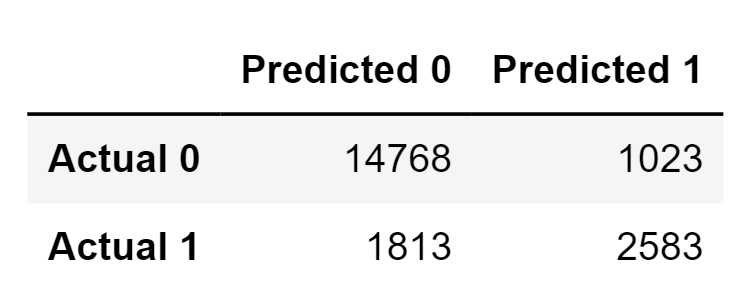
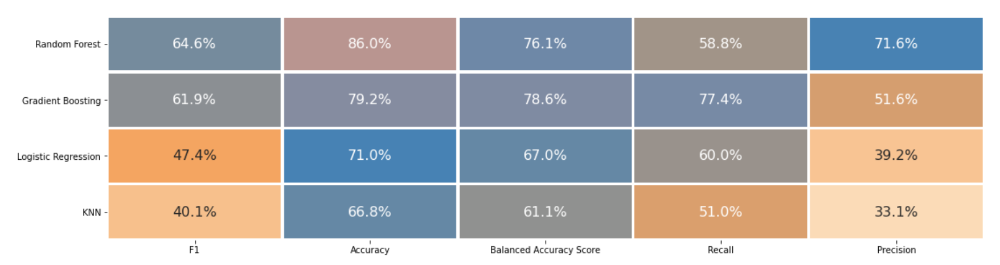
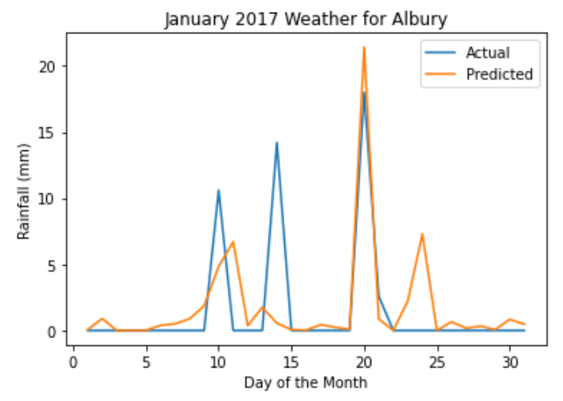

# Rainfall_in_Australia

## Selected Topic 
Analysis of daily rainfall levels in each of Australia’s six states (New South Wales, Queensland, South Australia, Tasmania, Victoria, and Western Australia) from the years 2011-2016. Different machine learning methods will be tested to determine which model most accuratley predicts rainfall in Australia for 2017. Forecasted results will then be compared with actual 2017 weather records. All information used during this project is from the same data source (Australian Government Bureau of Meteorology). 

## Explanation for Topic Selection 
Lack of rainfall has a negative impact on nature and the economy, and drought has always been a problem in Australia. Extreme dryness can cause the following:

-	Starting of wildfires 
-	Disruption of animal habitats and ecosystems
-	Loss of crop production
-	Negative impact of soil quality, affecting future growing seasons
-	Livestock casualties from lack of food available
-	Water shortages

## Questions We Hope to Answer 
Which machine learning model will most accuratly predict rainfall levels in Australia during the year 2017? Attaining an accurate rainfall foreccast in advance can help Australians prepare for potential drought. Some methods of drought preparation include water conservation, irrigation systems, crop diversification, and product sourcing.

## Resources
- **Data Source:**
    - Australian Government Bureau of Meteorology
    - Kaggle
- **Data File:**
- **Images:**
- **Database:**
- **Machine Learning:**
- **Presentation:**

## Tools/Technologies
- Database:
- Machine Learning:
- Visualization:

## Communication Protocols
Our team plans to use Slack and Zoom as primary communication means. Besides class hours, we also plan on having meetings during the week as needed. 

## Database Integration Summary

### Import Libraries
- import warnings
- import np, pd, dt, cfg, msno, s3fs
- from squalchemy import psycopg2
### Import data table from Postgres
- Import from AWS RDS database
### Data Analysis
- df.shape, df.info()
- replace '9999' with 'null'
- print values
### Handle Null Values
- handle nan in numeric columns
- handle nan in object columns
- count null values for each column
### Drop Unnecessary Columns
- create, load, and export 'weather_aus_clean' table
- merage 'weather_aus_clean' and "cities_aus' table
- create 'weather_aus_merge' table
=======
- Importation of pandas, numpy, and datetime
- Loading weatherAus.csv dataset
- Data pre-processing including dropping unnecessary columns and missing data
- Creation of database
- Creation of weather_aus_clean database table
- Import ‘weather_aus_clean’ into the database from AWS S3 buckets
- Creation of cities_aus database table
- Import cities_aus.csv into the database from AWS S3 buckets
- Join weather_aus_clean and cities_aus tables to create a final dataset including geographical data
- Import ‘weather_aus_merge’into the database from AWS S3 buckets

## Machine Learning Model Summary
We decided to create two types of machine learning models:

- Binary classification model: to predict Rain Tomorrow
- Regression model: to predict the amount of Rainfall in mm for a given day

For each option above, different models were compared to find the best fit.

### Prelimiary Data Processing
Data clean up steps:
- Source: Data was downloaded from Kaggle
- Dataset: Used data from 2011-2016 for the model due to the availability of consistent and valid data points for each year.
- Null/missing values handling: Explored the following options:
    1)  Drop all null values in rows and columns
    2)  Substitute null values with 9999
    3)  Substitute numeric null columns with mean and non-numeric null columns with mode

    **Recommendation:**  Models achieved best results using the following resolutions:
    - Binary Classification: Substitute null values with 9999
    - Linear Regression: Drop all null values

- Handling Date: Column was split and replaced by year, month and day.
- RainToday and RainTomorrow: Converted to binary (1/0) values

### Feature Engineering and Selection

**Binary Classification Model:** 
- OneHotEncoder to encode categorical columns
- Target variable for the model: RainTomorrow
- Training/Testing Data Split: 80/20 due to higher precision and accuracy score
- Standed Scaler to scale the data
- Ramdom Oversampling to address class imbalance due to high precision score as compared to SMOTE and SMOTEENN
- Used seaborn heatmap and model's feature importance for Feature selection.

**Regression Model:**
- Training/Testing Data Split: 70/30 split for better precision.
- Standed Scaler to scale the data
- Used seaborn heatmap for feature selection

### Model Selection - Random Forest

We decided to use Random Forest for both models (classification and regression) due to the following reasons:
- For our dataset, we believe that precision score is a better measure of model performance as opposed to recall. Random forest produced the highest precision and balanced accuracy scores for the dataset compared to other model evaluated.
- Random forest is robust against overfitting, outliers and large datasets
- It works well for classification and regression problems
- Its easier to work with if the dataset has lots of missing values

However, there are some disadvantages to this model:
- The model can be difficult to interpret.
- It may require higher computational power and training time.
- It can quickly reach a point where more samples may not improve precision/accuracy.

### Binary Classification Model Analysis

**How did the model perform?**

Confusion matrix and classification reports were used to evaluate model's performance

 
Confusion Matrix: 
 

 
 
Classification Reports:

 
 

- Model's accuracy score is 76% - this means it accurately predicts rain on a given day 76% of the time
- For this model, precision score holds more importance to properly plan for droughts. High recall means high false positives which in turn can inaccurately miss drought predictions.
- Model precision: 89% for no-rain, 72% for rain. This implies that model correctly predicts no-rain 89% of the time, and rain 72% of the time.

Overall, model's precision percentage is conservative which means that its predicted rainy days count will be lower than the count of days it actually rained. This can be acceptable as the intention is to not overestimate rainfall. However, model's performance can be improved with additional geological components and  data will lower percentage of missing values.

**Comparison with Other Models**

It has been established that precision is a better measure of binary classification model performance where random forest outperforms other models.

 

 
 

### Regression Model Analysis

To find appropriate model to predict rainfall in mm, seaborn distplot was used to visual data distribution of predicted values vs actual values.

Random forest regression model produced better results than linear regression.

 
RF --> Random Forest
 
LF --> Linear Regression

 
 

 
 

r-squared values:
- Linear Regression r-squared: 0.16802
- Random Forest r-squared: 0.32257

 R square value helps determine how well dependent variable value is explained by the determining(independent) variables of the dataset. Higher R square value indicates better model and results.

 In our case, this value is 32% which is on the lower side, but it can be improved by using data with fewer null values and having additional features such as evaporation, dew point etc.

The image below shows Jan 2017 actual  vs predicted rainfall (in mm) in Albury using random forest:

 
 

  

## Interactive Visualization and Dashboard Blueprint
### Interactive map of Australia created on Tableau
- Drop down menu for viewing rainfall levels by year
- Viewable on dashboard by creating embedded link and placed in HTML webpage code
### Linear Regression
- Actual vs. predicted model chart
### Binary Model Comparison
- Random Forest, Gradient Boosting, Logistic Regression
- F1, Accuracy, Balanced Accuracy, Recall, and Precision scores

